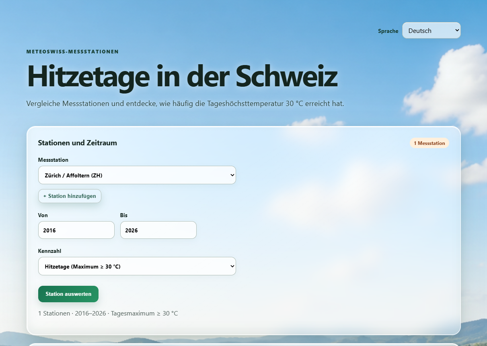
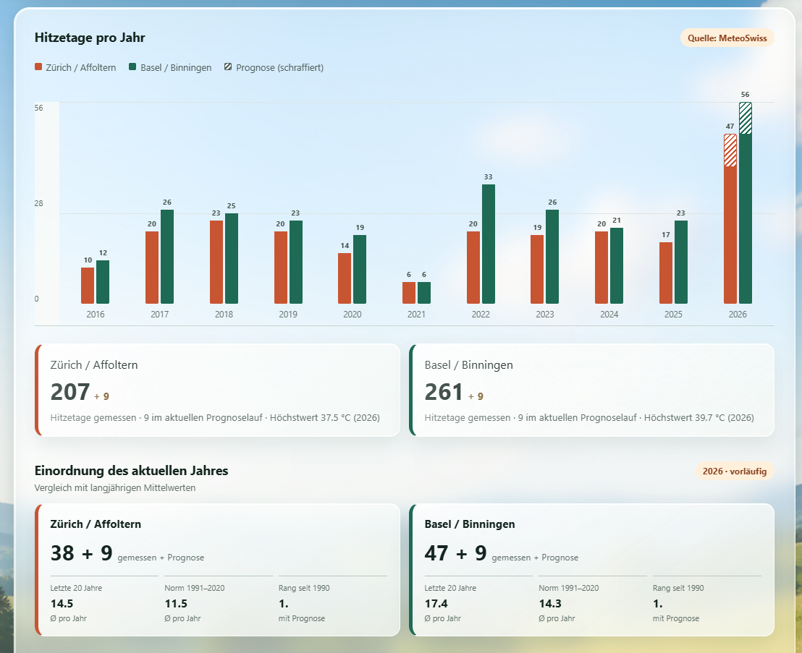
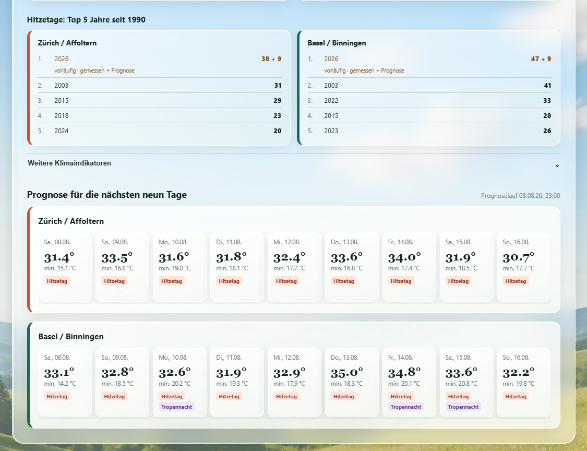

# Hitzetage Schweiz

Webanwendung zum Vergleichen von Hitzetagen und Tropennächten an MeteoSwiss-Messstationen. Historische Jahreswerte, langjährige Vergleiche und die aktuelle Neun-Tage-Prognose werden in einer gemeinsamen Oberfläche dargestellt.

## Live-Anwendung

Die öffentlich zugängliche Anwendung ist unter **[hitzetage.ch](https://hitzetage.ch)** erreichbar.

Die anonyme Reichweitenmessung erfolgt über eine selbst gehostete Umami-Instanz. Sie verwendet keine Cookies und ist auf die Produktionsdomains `hitzetage.ch` und `www.hitzetage.ch` begrenzt.

Für Suchmaschinen stellt die Anwendung eine kanonische URL, strukturierte `WebApplication`-Daten, eine `robots.txt` und eine XML-Sitemap unter <https://hitzetage.ch/sitemap.xml> bereit.

- **Hitzetag:** Tagesmaximum mindestens 30 °C
- **Tropennacht:** Tagesminimum mindestens 20 °C
- **Backend:** Java 21 und Spring Boot
- **Frontend:** HTML, CSS und JavaScript
- **Betrieb:** ein Docker-Container, keine Datenbank erforderlich
- **Sprachen:** Deutsch, Französisch, Italienisch, Rätoromanisch, Englisch und Chinesisch

## Schnellstart mit Docker

Benötigt werden [Git](https://git-scm.com/downloads) und [Docker Desktop](https://www.docker.com/products/docker-desktop/). Nach dem Start von Docker Desktop in einem Terminal ausführen:

```bash
git clone https://github.com/leviathary/hitzetage-schweiz.git
cd hitzetage-schweiz
docker compose up --build -d
```

Anschließend **<http://localhost:8080>** im Browser öffnen. Beim ersten Start lädt Docker die benötigten Basis-Images und baut die Anwendung; das kann einige Minuten dauern.

Status und Protokoll anzeigen:

```bash
docker compose ps
docker compose logs -f app
```

Anwendung stoppen:

```bash
docker compose down
```

## Konfiguration

Die Voreinstellungen funktionieren ohne zusätzliche Konfiguration. Optional kann eine lokale `.env`-Datei angelegt werden:

```bash
cp .env.example .env
```

Unter Windows PowerShell funktioniert alternativ:

```powershell
Copy-Item .env.example .env
```

Verfügbare Einstellungen:

| Variable | Standard | Bedeutung |
|---|---:|---|
| `APP_PORT` | `8080` | Port, unter dem die Webseite lokal erreichbar ist |
| `SPRING_PROFILES_ACTIVE` | `default` | `default` für MeteoSwiss oder `demo` für Offline-Beispieldaten |

Ist Port 8080 bereits belegt, in `.env` beispielsweise `APP_PORT=8081` setzen und danach <http://localhost:8081> öffnen.

### Offline-Demomodus

Für Entwicklung ohne Zugriff auf MeteoSwiss in `.env` Folgendes setzen:

```dotenv
SPRING_PROFILES_ACTIVE=demo
```

Danach den Container neu erstellen:

```bash
docker compose up --build -d
```

Der Live-Betrieb ersetzt fehlgeschlagene MeteoSwiss-Abfragen nicht unbemerkt durch Demodaten. Ist die Datenquelle beim ersten Abruf nicht erreichbar, meldet die API HTTP 503.

## Aktualisieren

Eine vorhandene Installation auf den neuesten Stand bringen:

```bash
git pull
docker compose up --build -d
```

Lokale Änderungen sollten vor `git pull` committed oder anderweitig gesichert werden.

## Lokaler Start ohne Docker

Voraussetzungen: JDK 21 und Maven 3.9 oder neuer.

```bash
mvn spring-boot:run
```

Tests ausführen:

```bash
mvn test
```

## Funktionen

- eine oder mehrere Messstationen auswählen
- Messstationen auf einer interaktiven Schweizkarte suchen und hinzufügen
- Stationshöhe in Auswahl und Karteninformation anzeigen
- Hitzetage und Tropennächte pro Jahr darstellen
- gemessene und prognostizierte Ereignisse im aktuellen Jahr unterscheiden
- einzelne Hitzetage als temperaturabhängige Zeitachsen darstellen
- mehrere Jahre per Klick im Jahresdiagramm auf der Zeitachse vergleichen
- ausgewählte Stationen miteinander vergleichen
- aktuelles Jahr mit dem Mittel der letzten 20 Jahre und der Norm 1991–2020 einordnen
- Rang und Top-5-Jahre seit 1990 anzeigen
- weitere Klimaindikatoren aufklappen
- Prognose für die nächsten neun Tage anzeigen

## Stationskarte verwenden

Über **„Station auf Karte wählen“** lässt sich eine zoombare OpenStreetMap-Karte öffnen. Sie zeigt die MeteoSwiss-Stationen an ihren offiziellen WGS84-Koordinaten:

- nicht ausgewählte Stationen erscheinen als schwarze Punkte
- ausgewählte Stationen werden größer und rot hervorgehoben
- ein Klick auf einen schwarzen Punkt fügt die Station zur Auswertung hinzu
- der Tooltip und das Informationsfeld zeigen Name, Kanton und Stationshöhe
- das Suchfeld filtert nach Stationsname, MeteoSwiss-Kürzel oder Kanton
- maximal sechs Stationen können gleichzeitig ausgewählt werden

Die Kartenbibliothek Leaflet wird lokal aus dem Docker-Container ausgeliefert. Zum Laden der Kartenkacheln ist eine Internetverbindung zu OpenStreetMap erforderlich; Stations- und Wetterdaten werden weiterhin ausschließlich über das Backend von MeteoSwiss bezogen.

## Screenshots

### Stationsauswahl



### Jahresvergleich und Einordnung



### Rangliste und Neun-Tage-Prognose



## Datenquelle

Messwerte und Prognosen stammen aus dem offiziellen [MeteoSwiss-Open-Data-Angebot](https://www.meteoswiss.admin.ch/service-und-publikationen/service/open-data.html). Die Daten dürfen gemäß den [MeteoSwiss-Nutzungsbedingungen](https://opendatadocs.meteoswiss.ch/general/terms-of-use) auch bearbeitet und weiterverwendet werden; die Quelle muss genannt werden.

`MeteoSwissStationDataSource` lädt Stationsmetadaten sowie historische und aktuelle Tageswerte über `data.geo.admin.ch`. Die Prognose stammt aus der Sammlung `ch.meteoschweiz.ogd-local-forecasting`. Häufig benötigte Daten werden im Arbeitsspeicher zwischengespeichert, um unnötige Mehrfachabrufe zu vermeiden.

Die Anwendung ist kein offizielles Angebot von MeteoSwiss. MeteoSwiss übernimmt keine Gewähr für Richtigkeit, Aktualität oder Vollständigkeit der bereitgestellten Open Data.

Die interaktive Stationskarte verwendet die lokal eingebundene Open-Source-Bibliothek [Leaflet](https://leafletjs.com/) und Kartenkacheln von [OpenStreetMap](https://www.openstreetmap.org/copyright). Die jeweilige Quellenangabe wird direkt auf der Karte angezeigt.

## API

### Feedback verwalten

Das Feedback-Formular speichert jede Nachricht als einzelne JSON-Zeile im persistenten Docker-Volume. Die Einträge können auf dem Server gelesen werden mit:

```bash
docker compose exec app tail -n 50 /app/data/feedback.jsonl
```

Für eine Sicherung außerhalb des Containers:

```bash
docker compose exec -T app cat /app/data/feedback.jsonl > feedback-backup.jsonl
```

Die Datei bleibt bei `docker compose up`, Neubauten und Container-Neustarts erhalten. Sie wird erst entfernt, wenn das zugehörige Docker-Volume ausdrücklich gelöscht wird.

| Aufruf | Beschreibung |
|---|---|
| `GET /api/stations` | verfügbare Messstationen |
| `GET /api/stations/{id}/annual-values?fromYear=2022&toYear=2024` | Jahreswerte einer Station |
| `GET /api/stations/{id}/forecast` | lokale Neun-Tage-Prognose |
| `GET /api/stations/{id}/heat-days?year=2024` | einzelne gemessene Hitzetage eines Jahres |

Beispiel:

```bash
curl "http://localhost:8080/api/stations/SMA/annual-values?fromYear=2022&toYear=2024"
```

## Projektstruktur

```text
src/main/java/ch/hitzetage/          Spring-Boot-Anwendung
src/main/java/ch/hitzetage/station/  API, Modelle und MeteoSwiss-Anbindung
src/main/resources/static/           HTML, CSS, JavaScript und Bilder
src/test/                             API-Tests
Dockerfile                            zweistufiges Container-Build
compose.yaml                          lokaler Ein-Container-Start
.env.example                          optionale lokale Einstellungen
```

## Häufige Probleme

**Docker-Befehl kann den Docker-Dienst nicht erreichen**

Docker Desktop starten und warten, bis dort „Engine running“ angezeigt wird.

**Port 8080 ist bereits belegt**

In `.env` einen anderen Port setzen, beispielsweise `APP_PORT=8081`, und den Container neu starten.

**Die erste Auswertung dauert länger**

Beim ersten Abruf werden die benötigten MeteoSwiss-Dateien geladen und ausgewertet. Weitere Abrufe verwenden den Cache.

**Änderungen sind im Browser nicht sichtbar**

`docker compose up --build -d` erneut ausführen und den Browser mit `Strg+F5` aktualisieren.

## Lizenz

Der Quellcode steht unter der [MIT-Lizenz](LICENSE). Er darf verwendet, verändert und weitergegeben werden, sofern der Copyright- und Lizenzhinweis erhalten bleibt.

Die MeteoSwiss-Daten sind davon unabhängig und unterliegen den oben verlinkten Nutzungsbedingungen von MeteoSwiss.
